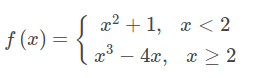
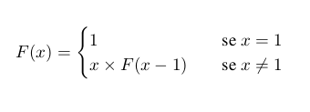
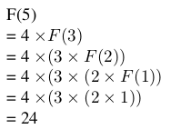

# Introdução a Haskell

Uma função em `Haskell` tem bastantes semelhaças com um função matematica.

Por exemplo:

```
f(x)=2x
```

em `Haskell` seria:

```Haskell
f x = 2 * x
```
<br>

## Tipos
Em `Haskell` são muito importantes os tipos das funções, por exemplo, o tipo da
função anterior seria:
```Haskell
f :: Int -> Int
```
isto indica-nos que a função tem como input um `Int` (numero inteiro) e como
output outro `Int`.

Outros tipos importantes a saber são:

- `Float`: Números reais
- `Bool`: `False` ou `True`
- `Char`: Caracteres (`'a'`, `'b'`, etc)
- `[a]`: Lista de `a`. Esta pode ser uma lista de qualquer coisa, se quisermos ser especificos podemos usar `[Int]` para uma lista de `Int`s.
- `String`: Texto. Este é equivalente a escrever `[Char]` porque texto é apenas uma lista de caracteres. 

Podemos ainda definir novos tipos. Há dois metodos para isto:

A keyword `type` permite definir um *alias* para outro tipo.
```Haskell
type Hora = (Int,Int)
```
Assim, escrever `Hora` ou `(Int,Int)` é equivalente mas o primeiro mostra alguma intenção, ou seja, uma função que receba uma `Hora` diz-nos que irá intrepertar o par como `(Horas, Minutos)`.

A keyword `data` permite definir um **novo** tipo de dados
```Haskell
data Hora = H Int Int
```

Isto irá ser aprofundado mais a frente.

<br>

## Operadores
Os operadores que podemos usar são os mesmos da matemática: `+`, `-`, `*` e `/` para operações aritemeticas mais os operadores lógicos:

- `>` `<`: maior e menor
- `>=` `<=`: maior ou igual e menor ou igual
- `==`: Igualdade

<br>

## Estruturas de controlo
Em certas ocasiões um função pode ter de fazer um processamento mais complexo do
seu input.

Por exemplo a função seguinte:



em `Haskell` fica
```Haskell
f :: Int -> Int
f x | x < 2  = x^2 + 1
    | x >= 2 = x^3 - 4 * x
```
A isto chamam-se guardas. É possível acrescentar um caso no fim da guarda que executa caso nenhuma das condições seja satisfeita.
```Haskell
f :: Int -> Int
f x | x < 0     = x^2 + 1
    | x == 0    = x
    | otherwise = x^3
```

Para além destas podemos ainda usar `if then else` apesar de este não ser tão legivel:
```Haskell
f :: Int -> Int
f x = if x < 2 then x^2 + 1 else x^3 - 4 * x
```

<br>

## Pattern matching
Podemos também tratar o input de uma função com *pattern matching*, por exemplo, para definir a negação lógica ( ¬ ) podemos fazer a seguinte função.
```Haskell
negacao :: Bool -> Bool
negacao False = True
negacao True = False
```

Isto quer dizer que sempre que a função recebe um `False` devolve um `True` e vice versa.

Outra forma de fazer isto é com um `case`:
```Haskell
negacao :: Bool -> Bool
negacao x = case x of
            False -> True
            True -> False
```

Pattern matching pode ser aplicado para todos os tipos de dados, como iremos ver noutros resumos.

<br>

## Exemplos de funções

```Haskell
perimetro :: Float -> Float
perimetro r = 2 * 3.14 * r
```

```Haskell
soma :: Int -> Int -> Int
soma a b = a + b
```

```Haskell
type Hora = (Int,Int)

avancaUmaHora :: Hora -> Hora
avancaUmaHora (23,m) = (0,m)
avancaUmaHora (h,m)  = (h + 1, m)
```

```Haskell
data Hora = H Int Int

avancaUmaHora :: Hora -> Hora
avancaUmaHora (H 23 m) = H 0 m
avancaUmaHora (H h m) = H (h + 1) m
```

<br>

## Recursividade

O factorial de um número é um classico exemplo de recursividade.

Sabendo que o factorial de `1` é `1` e que o factorial de `3` é igual a `3` vezes o factorial de `2`:

`1! = 1`

`3! = 3 * 2!`

Podemos então definir uma função que descreve o factorial:



Esta função é recursiva, pois é definida à custa dela própria.

Como exemplo, vamos calcular o valor de `F(4)`, como para qualquer função temos apenas de substituir `F(4)` pela definição.



Agora para definir-mos isto em `Haskell` é bastante similar:

```Haskell
factorial :: Int -> Int
factorial 1 = 1
factorial x = x * factorial (x - 1)
```

Podemos calcular o factorial de 4 com esta definição também:

```Haskell
factorial 4
= 4 * factorial 3
= 4 * (3 * factorial 2)
= 4 * (3 * (2 * factorial 1))
= 4 * (3 * (2 * 1))
= 4 * (3 * 2)
= 4 * 6
= 24
```

<br><br>

[](https://david81820.github.io/Recursos-LCC/1ano/1sem/PF)

