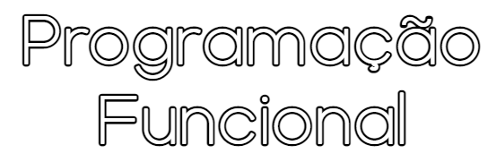

## [Detalhes da UC](Info.md)
Lista dos vários detalhes técnicos da cadeira que podem ser encontrados na aba "Plano de Estudos" do catálogo electrónico na página [Oferta Educativa - LCC](https://www.uminho.pt/PT/ensino/oferta-educativa/_layouts/15/UMinho.PortalUM.UI/Pages/CatalogoCursoDetail.aspx?itemId=3851&catId=12).

 

## [[A] Introdução ao Haskell](Intro.md)
Haskell é a linguagem usada para introduzir e explicar os conceitos do paradigma de programação funcional.

* [**Sintaxe de Programação básica**](http://rigaux.org/language-study/syntax-across-languages-per-language/Haskell.html)
* [**Functional Programming Course**](https://github.com/system-f/fp-course)

 

## [Slides da UC](slides-PF-Haskell.pdf)
Estes slides apesar de terem sido fornecidos pelos professores, são notados pelos mesmos como "antigos".

Aqui está alguns slides extra, "não-oficiais" claro:
* [[A] Haskell_Cheat_Sheet.pdf](slides/Haskell_Cheat_Sheet.pdf)
* [[A] Haskell_Programação.pdf](slides/Haskell_Programação.pdf)
* [[A] Introdução_ao_Haskell.pdf](slides/Introdução_ao_Haskell.pdf)
* [[A] Programação_Haskell.pdf](slides/Programação_Haskell.pdf)
* [[A] Tabela_ASCII.pdf](slides/Tabela_ASCII.pdf)
* [[A] Tutorial_Haskell.pdf](slides/Tutorial_Haskell.pdf)

 

## [Fichas](fichas/README.md)
Fichas de exercícios fornecidas pelo corpo docente, juntamente com resolução dos alunos.

 

## [Testes e Exames](testes/README.md)
As 50 Questões, Testes e Exames desde do ano lectivo 2015-2016, até 2020-2021. Incluí resoluções feitas por alunos.

  

