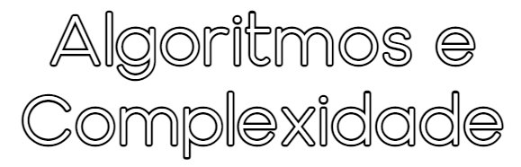

## [Detalhes da UC](Info.md)
Lista dos vários detalhes técnicos da cadeira que podem ser encontrados na aba "Plano de Estudos" do catálogo electrónico na página [Oferta Educativa - LCC](https://www.uminho.pt/PT/ensino/oferta-educativa/_layouts/15/UMinho.PortalUM.UI/Pages/CatalogoCursoDetail.aspx?itemId=3851&catId=12).

 

## [Material Teórico da UC](slides/README.md)
Várias notas e explicações.
Aqui abaixo listei também algum material "não-oficial":

* [**Site de visualização de Árvores AVL**](https://www.cs.usfca.edu/~galles/visualization/AVLtree.html)
* [**Manual de Design de Algoritmos - Steven S. Skiena**](SkienaTheAlgorithmDesignManual.pdf)

 

## [Fichas](fichas/README.md)
Fichas de exercícios fornecidas pelo corpo docente, desde do ano lectivo 2010/2011 a 2021/2022.

 

## [Testes e Exames](testes/README.md)
Testes e Exames dos anos anteriores.
