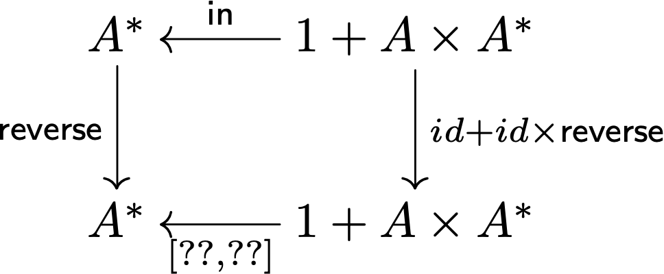
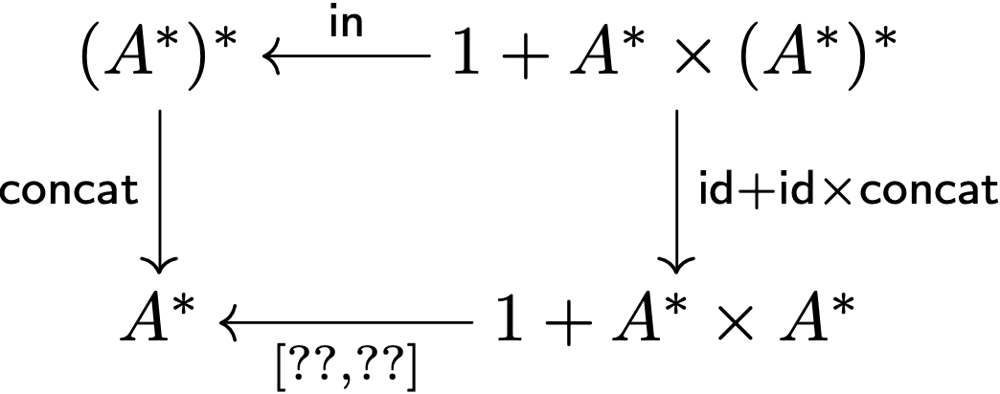
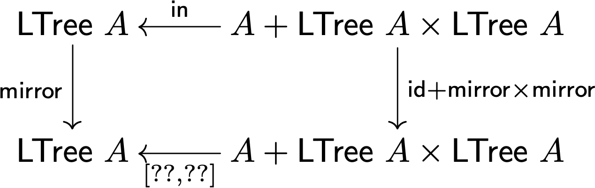
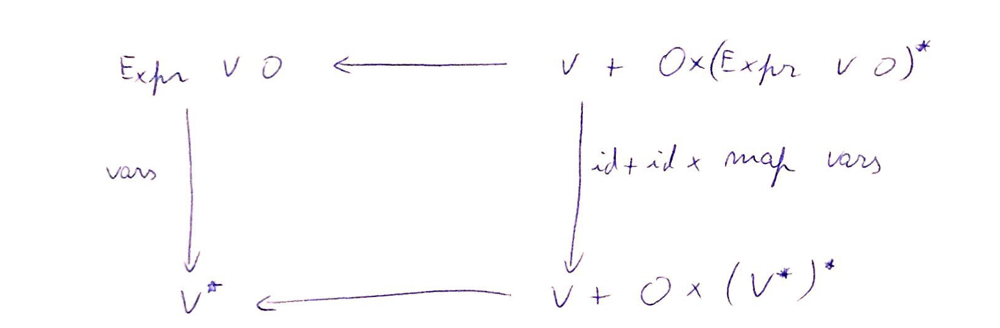

# ficha 6

## Exercicio 1a

 
agora que temos o in e o out destes tipos, podemos fazer catas com eles
se se lembrarem dos catas das naturais
era basicamente um padrão em que tínhamos uma função para o caso de paragem, e outra para os outros casos
nas listas é igual, só que a agora no paso recursivo temos mais info, o elemento da lista
para aquecer, e relembrar a lei universal cata, vamos fazer a 1a sobre naturais
lembrem-se da semana passada, podíamos definir um ciclo for à custa dum cata de naturais

aqui o que pede é para mostrar que for id i = for i̲ i

    for id i = for i̲ i  
    ≡ { def for }  
    	⦇[i̲, id]⦈ = ⦇[i̲, i̲]⦈  
    ≡ { universal-cata nats (43) }  
    	⦇[i̲, id]⦈ . in = [i̲, i̲] . (id + ⦇[i̲, id]⦈)  
    ≡ { absorção-+ (22), fusão-const (4) }  
    	⦇[i̲, id]⦈ . in = [i̲, i̲]  
    ≡ { cancelamento-cata nats (44) }  
    	[i̲, id] . (id + ⦇[i̲, id]⦈) = [i̲, i̲]  
    ≡ { absorção-+ (22) }  
    	[i̲,⦇[i̲, id]⦈] = [i̲, i̲]  
    ≡ { eq-+ (27) }  
    	i̲ = i̲  
    	⦇[i̲, id]⦈ = i̲ -- resposta à questão "o que são estes fors"  
    ≡ { universal-cata nats (43) }  
    	true  
    	i̲ . in = [i̲, id] . (id + i̲)  
    ≡ { fusão-const (4), absorção-+ (22) }  
    	i̲ = [i̲,i̲]  
    ≡ { ex 2, ficha 2 (ou provado através de universal-+) }  
    	true

## Exercicio 1b

vamos tentar definir alguns catas sobre listas
catas sobre listas, se se lembram de PF ou LI1, são foldrs funções recursivas que em cada passo aplicam uma certa função até chegar ao caso de paragem o cata dá-nos a estrutura toda de graça, só temos que definir aquilo que chamamos de _gene_ se olharem para os diagramas do ex 1, é a seta `g` no fundo do diagrama

vamos começar por exemplo pela b.ii o `reverse` duma lista um catamorfismo atua sempre passo a passo na lista o passo recursivo vai ser pegar no elemento à cabeça, e pô-lo no fim da lista uma coisa que ajuda é fazer um diagrama que instancie o diagrama geral dos catas ou seja, substituir o `B` por algo concreto o tipo de saída do `reverse` é uma lista.

vai ficar algo deste género o cata que queremos definir é o `reverse` por isso substituem ⦇g⦈ por reverse e vão ver que no fim só temos que definir a seta de baixo o tal gene _g_

e ainda sabemos algo mais: que este gene é um **either** porque no passo recursivo ou recebemos uma lista vazia, ou um elemento e o resto da lista já `reverse`d reparem que o tipo no canto inferior esquerdo

significa ou recebemos uma lista vazia
ou recebemos um par com um elemento da lista e o **resto da lista já invertida**

sendo assim, como fazemos este either? o que vai do lado esquerdo? como invertemos a lista vazia?

lado esquerdo vai nil

gora do lado direito precisamos de algo do tipo `g2 : A x A* -> A*`

não precisa de ser pointfree

o pointfree é para quando queremos fazer contas, aqui só queremos dar uma definição

ou seja, podemos dizer que

`g2 (a,l) = ...?` em pointwise se calhar já não se lembram bem de haskell, mas isto seria algo tipo

`g2 (a,l) = l ++ [a]`

concatenar o elemento no fim da lista por isso podíamos definir o gene como  

    g = [nil,g2]  
       where g2 (a,l) = l ++ [a]

qual é a vantagem disto? é que só temos q pensar no gene _g_

e tudo o resto vem de graça tanto a execução do cata, como todas as propriedades algébricas que usamos para provar coisas tentem pensar no `concat`

façam o diagrama e sugiram soluções para o gene o `concat : (A*)* -> A*` pela numa lista de listas e transforma-se numa única lista se instanciarmos o diagrama dos catas temos...

parece manhoso, mas o que é que aconteceu aqui? o `concat` não funciona para listas de As genéricas, não é para A*
é especificamente para (A*)* por isso temos que tornar o tipo mais concreto
por isso todos os A* foram substituídos por (A*)* depois temos o tipo de saída, A*
por isso todos os Bs foram substituídos por A* tudo isto para termos o tipo do gene `[g1,g2] : 1 + A* x A* -> A*`

então, voltemos ao `[g1,g2] : 1 + A* x A* -> A*`
a entrada é ou uma lista vazia ou uma lista e o resultado de todas as outras já concatenadas

`g1 = nil`
(`nil` está definido no exercício como a função que devolve sempre `[]` )

    outl [] = Left ()  
    outl l = Right (head l,tail l)inl :: Either () (a,[a]) -> [a]  
    inl = either (const []) conscatal g = g . (id -|- (id >< catal g)) . outl

## Exercicio 2

o processo é o mesmo, só que agora temos que ter em consideração o padrão das árvores em vez de listas

se olharmos para leaf trees, como já vimos hoje

onde tínhamos `1 + A x A*` para listas passamos a ter `A + T x T` para leaf trees

vamos começar pelo mirror, virar uma árvore ao contrário

tentem fazer o diagrama

comecem pelo tipo do `mirror` qual é?

recebe uma LTree e vira-a ao contrário
por isso `mirror : LTree a -> LTree a`, certo? o `mirror` é o nosso cata, por isso é a seta vertical do diagrama do lado esquerdo de seguida fazemos o in a apontar para lá, `in : Tree a <- a + LTree a x LTree a`

`F f = id + f x f`

então agora só falta o gene
`[g1,g2] : A + LTree A x LTree A -> LTree A`

o que será o `g1` ?  Leaf
e `g2` ? `g2 (l,r) = Fork (r,l)`
atenção ao tipo do `Fork` , recebe par

por isso se desenharem o diagrama, vão acabar com um gene do tipo

`[g1,g2] : A + LTree N x LTree N -> LTree N`

então, se recebermos um valor A que veio duma folha..?

(o zeros mete uma árvore toda a zeros) Esse valor tem que ficar a zero certo? por isso g1 há de ser algo tipo `Leaf . zero`

como é que vemos isto tudo a funcionar?

definimos o out e o cata para LTrees...  

    outf (Leaf a) = Left a  
    outf (Fork (l,f)) = Right (l,f)cataf g = g . (id -|- (cataf g >< cataf g)) . outf

e agora podemos definir estas funções

    zeros = cataf (either (Leaf . const 0) Fork)  
    mirror = cataf (either Leaf (Fork . swap))

e podem correr

    *Main> zeros (Fork (Fork (Leaf 1,Leaf 2),Fork (Leaf 3,Leaf 4)))  
    Fork (Fork (Leaf 0,Leaf 0),Fork (Leaf 0,Leaf 0))

ou

    *Main> mirror (Fork (Fork (Leaf 1,Leaf 2),Fork (Leaf 3,Leaf 4)))  
    Fork (Fork (Leaf 4,Leaf 3),Fork (Leaf 2,Leaf 1))

## Exercicio 2d e 4  

Relembre árvores de expressão:data Expr v o = Var v | Op (o,[Expr v o])

    T = Expr V O
    F X = V + O x X*
    F f = id + id x map f
    Var: V -> Expr V OOp: O x (Expr V O)* -> Expr V Oin=[Var, Op]

  

qual o tipo do gene g?

      g: V + O x (V*)* -> V*
    

      g (i1 v) =?
        g (i2 (o,llv)) = ?

g.i1 recebe uma variável e tem de a transformar numa lista.
g.i2 recebe um par (o,llv) em que o é um valor do tipo O e llv é um valor do tipo lista de listas de variáveis (uma lista de variáveis por cada subexpressão - note que (V*)* é o resultado do map vars aplicado a um valor do tipo `(Expr V O)*)`.

  

Nós queremos pegar apenas na 2.a componente do par e transformar a lista de listas de variáveis numa lista de variáveis.

  

sugestões para g?

  

    g: V + O x (V*)* -> V*g (i1 v) = [v]
    
    g (i2 (o,llv)) = concat llv

  

e em pointfree?

    g=[singl, concat.p2]parasingl:: a -> [a]
    singl x =[x]

  

Então

  

    vars=(| [singl, concat.p2] |)
    <=> {43}   
    vars.in=[singl, concat.p2].(id + id x map vars)    
    <=> {def in, 20, 22,1}    
    [vars.Var,vars.Op]=[singl,concat.p2.(id x map vars)]    
    <=>{27, 13}    
    vars.Var = singl    
    vars.Op=concat.(map vars).p2    
    <=> { 69,70}    
    vars (Var v) = singl v    
    vars (Op (o,le)) = concat ((map vars) (p2 (o,le)))    
    <=> {def. singl, 77}    
    vars (Var v) = [v]    
    vars (Op (o,le)) = concat (map vars le)

  

## Exercicio 5

  

    sumprod :: a -> [a] -> a (ignorando restrições de tipo)    
    sumprod a [ ] = 0    
    sumprod a (h : t) = a*h + sumprod a t

  
definida como o catamorfismo de listas:

  

    sumprod a = (| [zero, add.((a*) x id)] |)zero _ = 0
    add (x,y)=x+y

  

Queremos provar:

    sumprod a = (a*).sum

usando fusão-cata (46)
    
    (a*).sum = sumprod a    
    <=> {def. sum, def. sumprod a}    
    (a*).(| [zero, add] |)= (| [zero, add.((a*) x id)] |)    
    <= {46}    
    (a*). [zero, add]= [zero, add.((a*) x id)].(id + id x (a*))    
    <=> { 20, 22, 1}    
    [(a*).zero, (a*).add]=[zero,add.((a*) x id).(id x (a*))]    
    <=> { 27, 14}    
    (a*).zero=zero    
    (a*).add=add.((a*)x(a*))    
    <=> { 69}    
    (a*).zero x =zero x    
    (a*).add (y,z)=add.((a*)x(a*)) (y,z)    
    <=> {70, 75, def zero, def add}    
    a* 0 =0    
    a*(y+z)=a*y+a*z    
    <=>
    true - prop. elemento absorvente da multiplicação    
    true - prop. distributividade da multiplicação em relação à adição

## Exercicio 5 - Alternativa

## Exercicio 5

 O exercício 5, em particular,  mostra-nos que a função `sumprod` pode ser optimizada de forma a não chamar tantas vezes a operação de multiplicação (a*): notem que `sumprod` chama a operação (a*) n-vezes em que n é o tamanho da lista.  

**Usando cálculo de programas**, vamos converte-la numa função que chama (a*) apenas uma vez. 

Para dar mais algumas intuições, notem que enquanto a função _sumprod_ multiplica cada elemento da lista por 'a' e retorna o somatório destas multiplicações, a função _sum_ (que é função a qual nós queremos chegar), soma primeiro todos os elementos da lista e depois multiplica o somatório resultante por 'a'.

Para este exercício convém relembrar o functor F associado às listas: é definido como 

    F f = id + id x f.

`(a*) . sum = sumprod a`  
`≡ { Definição de sum e de (sumprod a)}`  
`(a*) . ⦇[zero, add]⦈ = ⦇[zero, add . ((a*) x id)]⦈`  
`<= { Lei fusão-cata, definição functor F das listas}`  
`(a*) . [zero, add] = [zero, add . ((a*) x id)] . (id + (id x (a*)))`  
`≡ { Fusão-+, Absorpção-+}`  
`[(a*) . zero, (a*) . add] = [zero . id, add . ((a*) x id) . (id x (a*))]`  
`≡ { Natural-id, Functor-x}`  
`[(a*) . zero, (a*) . add] = [zero, add . ((a*) x (a*))]`  
`≡ { Eq-+ }`  
`(a*) . zero = zero`  
`(a*) . add = add . ((a*) x (a*))`  
`≡ { Lei elemento absorvente e distributividade (a*0 = 0 e a*(x+y) = a*x + a*y) }`  
`True`
