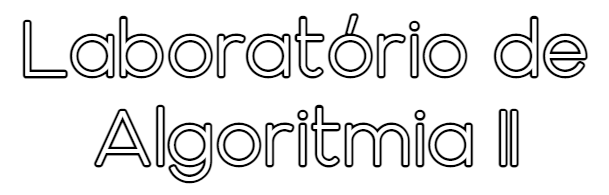

## [Detalhes da UC](Info.md)
Lista dos vários detalhes técnicos da cadeira que podem ser encontrados na aba "Plano de Estudos" do catálogo electrónico na página [Oferta Educativa - LCC](https://www.uminho.pt/PT/ensino/oferta-educativa/_layouts/15/UMinho.PortalUM.UI/Pages/CatalogoCursoDetail.aspx?itemId=3851&catId=12).

 

## [Material Teórico da UC](slides/README.md)
PDF's fornecidos pelo corpo docente - cada um relacionado a um Treino/Torneio - entre outros conteúdos.

* [**Sintaxe básica de Python**](http://rigaux.org/language-study/syntax-across-languages-per-language/Python.html)
* [**Automate the Boring Stuff with Python - Practical Programming for Total Beginners**](https://automatetheboringstuff.com/)
* [**Pyhton - GeeksforGeeks**](https://www.geeksforgeeks.org/python-programming-language/)

 

## [Fichas](fichas/README.md)
"Treinos" dados pelo corpo docente, para preparar alunos aos torneios de avaliação.

 

## [Testes e Exames](testes/README.md)
Os torneios de avaliação dos anos lectivos 2020/2021 e 2021/2022.

  

