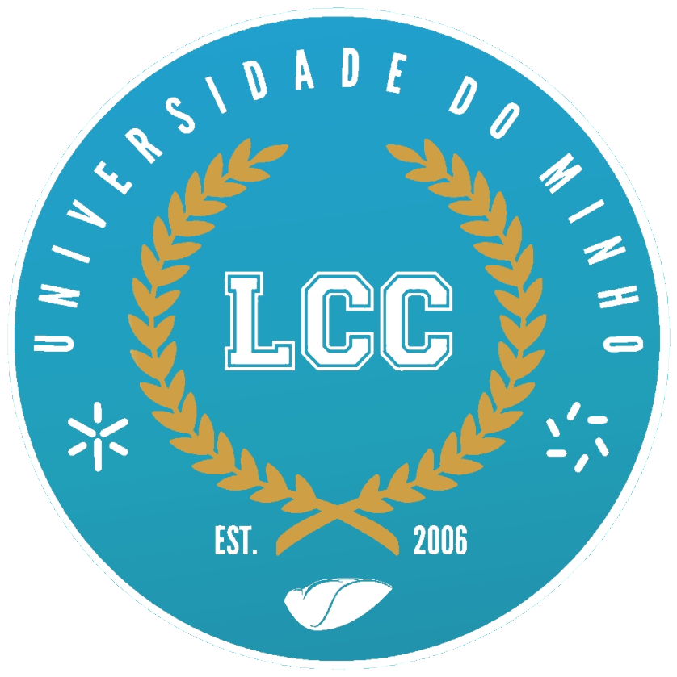

# Recursos LCC
**Um arquivo de todo material que consegui reunir, pertinente ao curso de LCC da UM.**
   

## Aviso
Esta colecção não deve ser usada como substituto das aulas e material disponibilizado pelos professores.
  A sua intenção é apenas servir como um complemento ao estudo.

À que ter especial cuidado com material proveniente de alunos, visto não serem fontes totalmente fidedignas quanto à sua "correcção".
  Dito isso, avancemos então para o material acumulado.
  

## 1º Ano
 * **1º Semestre**
 * **2º Semestre**

## 2º Ano
 * **1º Semestre**
 * **2º Semestre**

## 3º Ano
 * **1º Semestre**
 * **2º Semestre**

